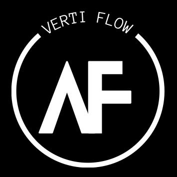

# Vertiflow - La Marque de Parkour

  
  

Vertiflow est la marque de parkour et une communauté dédiée aux passionnés. Nous proposons une expérience unique à travers notre boutique en ligne, nos événements et ateliers, ainsi qu'une plateforme collaborative pour promouvoir le parkour.

## Table des Matières

- [À Propos](#à-propos)
- [Fonctionnalités](#fonctionnalités)
- [Communauté](#communauté)
- [Contact](#contact)

## À Propos

Vertiflow réunit passion, innovation et esprit communautaire pour créer une destination incontournable pour les amateurs de parkour. Notre plateforme offre une vitrine pour découvrir et acheter des équipements de qualité, participer à des événements et ateliers, et s'engager avec une communauté vibrante.

## Fonctionnalités

- **Boutique en Ligne** : Explorez une sélection d'équipements et d'accessoires conçus spécialement pour le parkour.
- **Événements & Ateliers** : Participez à des sessions d'entraînement, des ateliers et des événements dédiés au parkour.
- **Plateforme Communautaire** : Rejoignez et échangez avec d'autres passionnés de parkour à travers nos forums et réseaux sociaux.
- **Code Open Source** : Bien que ce projet ne soit pas destiné à être copié, le code source est disponible sur [GitHub](https://github.com/votre-utilisateur/vertiflow) pour ceux qui souhaitent explorer son fonctionnement.

## Communauté

Nous croyons fermement que le parkour est avant tout une communauté. Rejoignez-nous sur [notre site](https://vertiflow.com) pour découvrir les dernières actualités, événements et initiatives. Votre passion et votre engagement font de Vertiflow bien plus qu'une simple boutique en ligne.

## Contact

Pour toute question ou suggestion, n'hésitez pas à nous contacter via notre [site officiel](https://vertiflow.com) ou à nous rejoindre sur [GitHub](https://github.com/votre-utilisateur/vertiflow).

---

Merci de votre intérêt pour Vertiflow !
